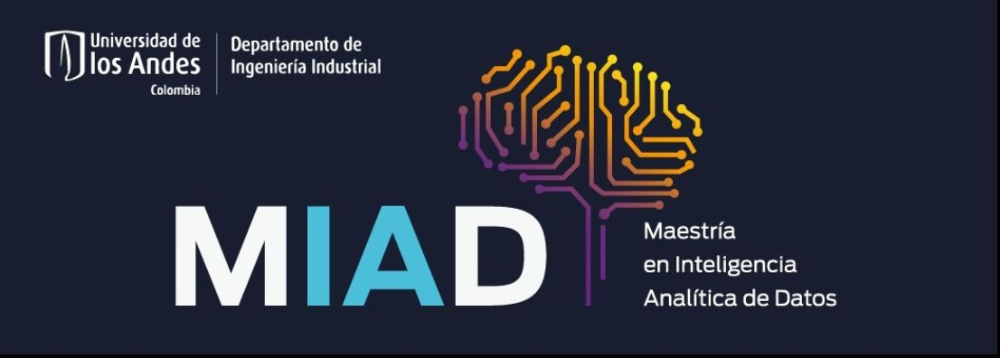

#  Hola a todos!, soy Walter Chingg Uparela (Wall.e)

Ingeniero Mecatrónico enfocado en Data Analytics y Machine Learning.

## Me puedes encontrar aqui o tambien afuera como...

## Un poco de lo que hago dentro de la maestria 

## Lenguajes 

          

## Herramientas

 
          

 
          

 
          
          

            
          
