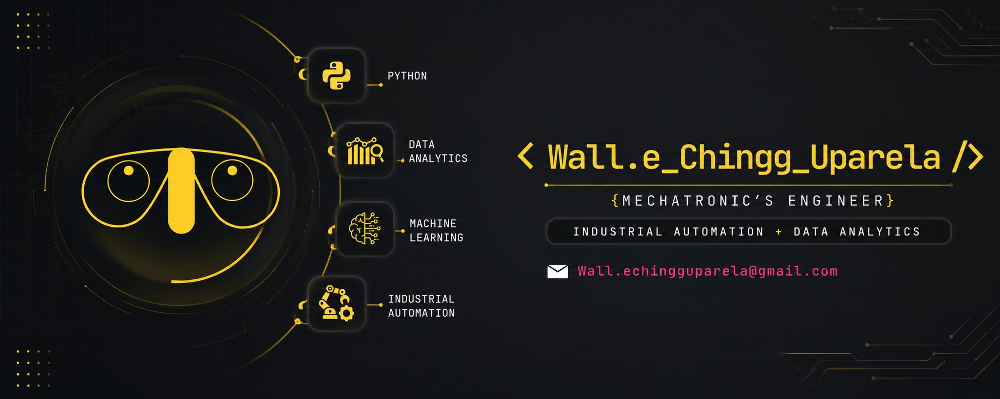
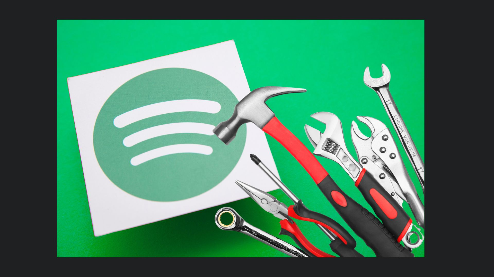

# 👋 Hola, soy Walter Chingg Uparela (Wall.e) / Hi, I´m Walter Chingg Uparela (Wall.e)

🚀 Ingeniero en Mecatrónica enfocado en **Data Analytics y Machine Learning**, apasionado por transformar datos en información útil para la toma de decisiones. / Mechatronic's Engineer focused on **Data Analytics and Machine Learning**, passionate about transforming data into useful information for decision making.
---

## 🌐 Conecta conmigo / Conect with me 

---
## 📂Proyectos en BI  y otros (en proceso...)

## 📂 Proyectos de Modelado y disponibilización en la nube 
### Predicción de popularidad de canciones
#### Frontend

#### Backend

## 📂Academico 
### Actividades maestria inteligencia analitica de datos

---

## 🛠️ Tecnologías y herramientas / Technologies and tools

### 👨‍💻 Lenguajes / Languages 

### 📊 Data & BI

### ⚙️ Herramientas / Tools

---

            
          
